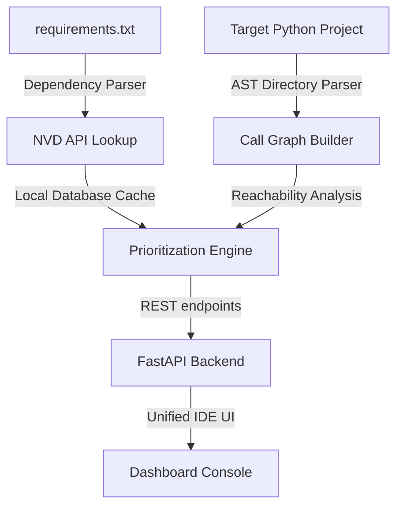

# Supply-Chain Reachability Auditor

An AST-guided Software Composition Analysis (SCA) and vulnerability prioritization engine for Python applications. 

Unlike standard dependency scanners that output flat, noisy CVE listings, this auditor constructs a global program call graph to determine if vulnerable third-party library functions are actually reachable from your application's execution flow.

---

## Key Features

* **AST-Guided Call Graph Builder:** Traverses Python source directories, resolves absolute/relative imports, and maps function definitions to call sites.
* **Reachability Analysis Engine:** Traces execution paths from a user-specified entry point to verify if a vulnerable package function is actively invoked or represents dead code.
* **Workspace Console Dashboard:** A custom-designed desktop-style workspace featuring:
  * **Interactive SVG Node Maps:** Vector diagrams linking entry points directly to vulnerable imports.
  * **Typographical Metrics Counters:** Dynamic summary indicators for scanned packages, total CVEs, and active reachable risks.
  * **Footer System Status Bar:** Live visual metrics tracking core engine status, NVD connection, and active scan directories.
* **Vulnerability Cache Database:** Local SQLite caching for package CVE lookups, avoiding unauthenticated NVD API rate-limiting delays.

---

## System Architecture



---

## Project Structure

```text
├── backend/
│   ├── database.py       # SQLAlchemy engine & session configurations
│   ├── models.py         # DB Schemas (Scan logs, findings, CVE cache)
│   └── main.py           # FastAPI endpoints & scan coordinator
├── framework/
│   ├── ast_parser.py     # Python AST node traversal & import resolver
│   ├── call_graph_builder.py # Global function call graph structures
│   ├── dependency_parser.py  # Requirements.txt specifications loader
│   ├── nvd_client.py     # NVD API queries & high-fidelity local fallback cache
│   ├── reachability_engine.py# Graph BFS reachability trace checker
│   └── scorer.py         # CVSS prioritizing & analyst remediation logs
├── frontend/
│   ├── index.html        # Unified workspace layout
│   └── app.js            # Front-end logic, visualizer, & meteor canvas
├── tests/                # Automated pytest unit testing suites
└── requirements.txt      # Project backend requirements
```

---

## Quick Start

### 1. Install Project Dependencies
Initialize a virtual environment and install the required modules:
```bash
# Initialize Virtualenv
python -m venv .venv
source .venv/bin/activate  # On Windows: .venv\Scripts\activate

# Install modules
pip install -r requirements.txt
```

### 2. Start the Backend API Server
Run the FastAPI backend using Uvicorn (binds to port 8000 by default):
```bash
python -m uvicorn backend.main:app --reload --port 8000
```

### 3. Launch the Dashboard
Open `frontend/index.html` in your browser. 
*(For the best experience, run it using the VS Code Live Server extension at http://127.0.0.1:5500/frontend/index.html)*.

### 4. Run Automated Tests
Verify AST parsing, import resolving, and call graph mechanics:
```bash
python -m pytest
```

---

## Usage Example
Input the following configurations into the left sidebar of your dashboard:
* **Target Project Folder:** `C:\path\to\supply-chain-scanner\test_target_2`
* **Requirements File:** `C:\path\to\supply-chain-scanner\test_target_2\requirements.txt`
* **Entry Point Function:** `start_app`

The center console will list findings, and selecting **jinja2** will draw a visual SVG vector trace proving its reachability via `start_app` -> `render_page` -> `jinja2`.

---

## Security and Scope Note
* **Local Sandboxing:** No code is executed during analysis; AST scanning is strictly static.
* **Scope Boundary:** Dynamic calls (like reflection, `getattr`, `eval`, or monkey-patched bindings) are out of scope.